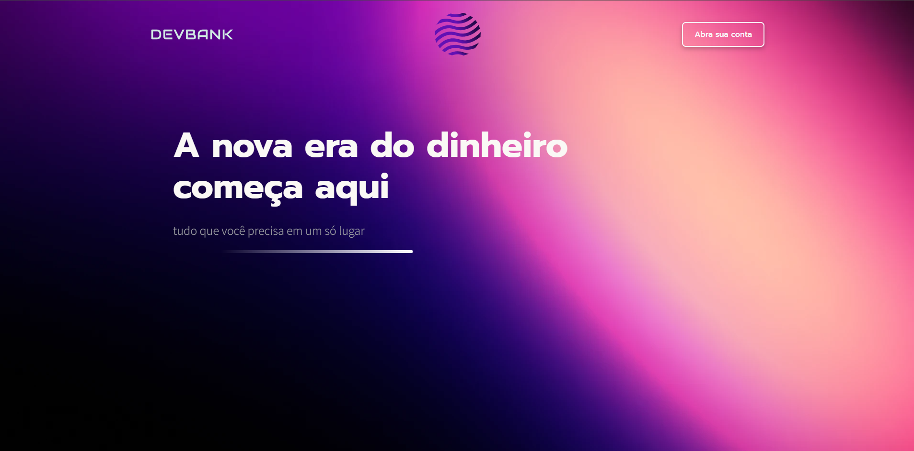
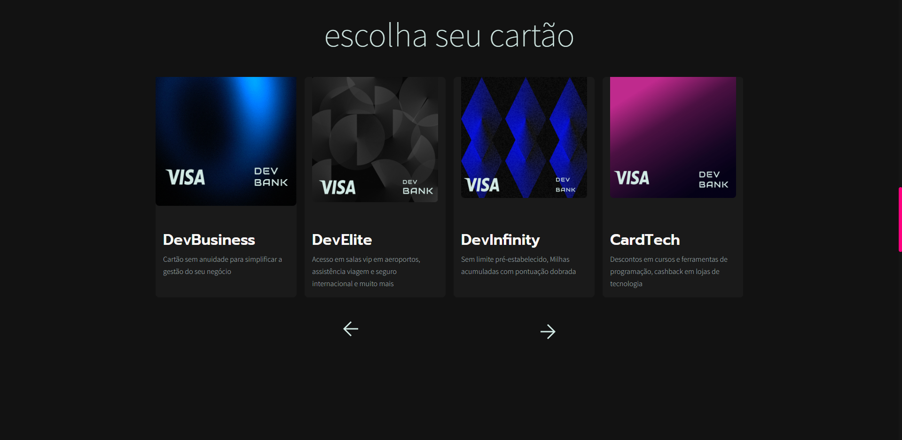

# 

## 
## 

### um projeto 100%  Desenvolvido por mim, desde o desing até subir ele, contando com uma biblioteca SASS feita por mim 

### que pode ser usada em qualquer projeto e sendo 100% editavel. Esse projeto foi muito importante pra mim, pois tive os primeiros contatos com figma e Swiperjs.

## 🚀 Tecnologias Utilizadas

### HTML https://img.shields.io/badge/HTML5-E34F26?style=for-the-badge&logo=html5&logoColor=white
### CSS https://img.shields.io/badge/CSS3-1572B6?style=for-the-badge&logo=css3&logoColor=white
### SASS https://img.shields.io/badge/Sass-CC6699?style=for-the-badge&logo=sass&logoColor=white
### JS https://img.shields.io/badge/JavaScript-323330?style=for-the-badge&logo=javascript&logoColor=F7DF1E
### SWIPERJS
### https://img.shields.io/badge/Figma-F24E1E?style=for-the-badge&logo=figma&logoColor=white

### Em breve terá mais atualizações com a biblioteca GSAP e com novas páginas.